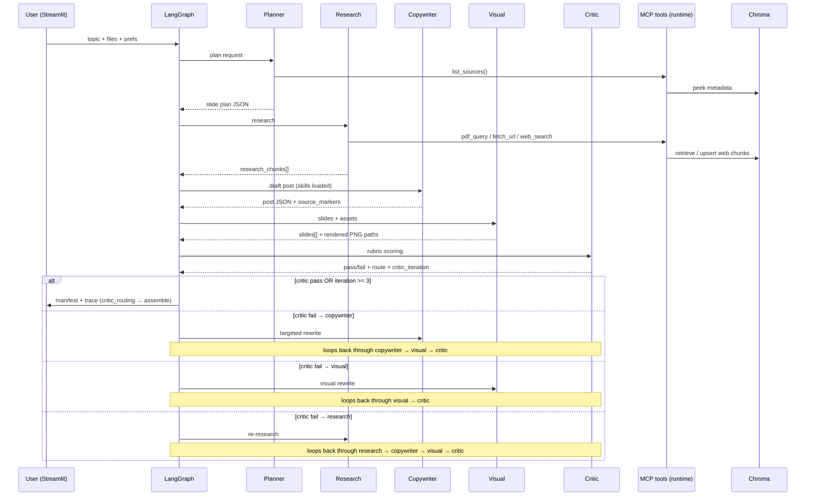

# Architecture

## Sequence (happy path)

## Agent roster & responsibilities

| Agent | Responsibility | Tools / skills |
|------|----------------|----------------|
| Planner | Slide plan, whether web grounding is needed | `list_sources`, `brand_voice` excerpt |
| Research | Grounding pack | `pdf_query`, `fetch_url`, `web_search`, caption helper for uploads |
| Copywriter | Hook/body/hashtags/CTA + `per_slide_captions` + `per_slide_bullets` (grounded, no placeholders) | `linkedin_formatting`, `citation`, `brand_voice` |
| Visual | Treatment decision (uploaded > PDF figure > mock), alt text, real asset path or mock render | `image_prompting` |
| Critic | Rubric + routing | `critic_rubric` |

## Skills discovery / loading

1. Skills live in `skills/<folder>/SKILL.md`.
2. `skill_loader.load_skill("<folder>")` parses optional YAML frontmatter (`name`, `description`) and markdown body.
3. Each graph node pulls **only** the skills it needs (see `graph/nodes.py`).

## Critic loop & observability

The critic runs after every visual pass. Its routing logic in `graph/workflow.py` emits two JSONL trace events per iteration:

| Event | Key fields |
|---|---|
| `agent_end` (critic) | `critic_iteration`, `max_retries_reached`, `passed`, `route`, `scores`, `issues` |
| `critic_routing` | `destination`, `critic_iteration`, `max_retries_reached`, `critic_passed`, `issues` |

The loop is hard-capped at **3 iterations** (`critic_iterations >= 3` → unconditional assemble). When `passed=true`, `issues` is always empty — the Python pre-check overrides any contradictory LLM output so the trace is never misleading.

## Grounding contract

Research emits chunks with stable `chunk_id` values. The copywriter returns `source_markers` referencing those ids. The UI sources panel is derived from `research_chunks` metadata (`modality`, `page`, `path`).
