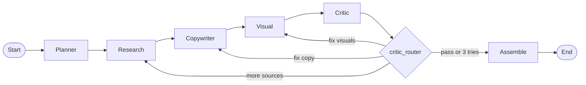
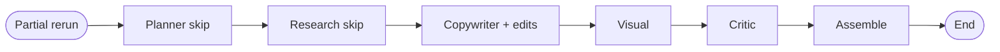
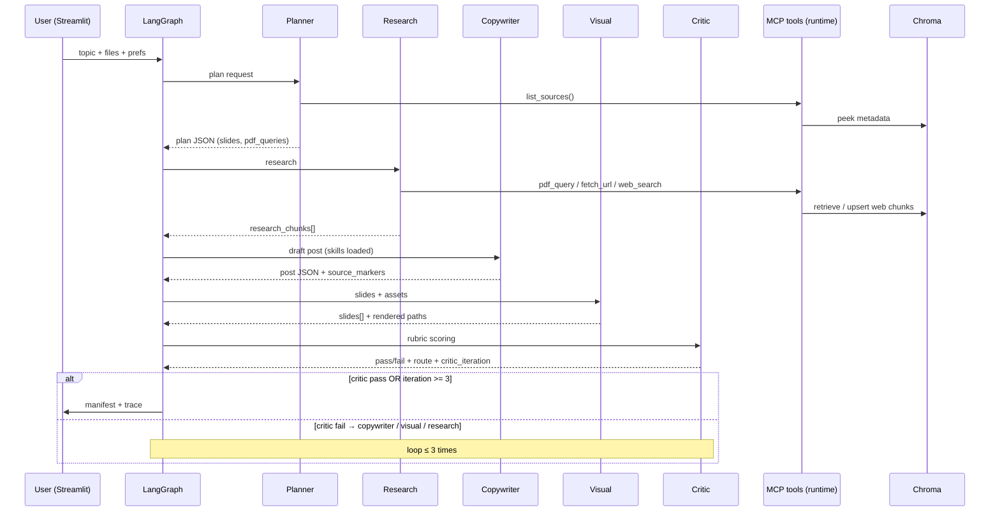

# Architecture

## LangGraph agent flow

**Partial rerun** (`rerun_scope: copywriter`): planner and research are skipped; graph still enters at planner but those nodes return `{}` and keep prior `plan` + `research_chunks`. Then copywriter → visual → critic → assemble.

## Sequence (happy path)

## Agent roster & responsibilities

| Agent | Reads | Writes | LLM? | Tools / skills |
|------|--------|--------|------|----------------|
| **Planner** | topic, tone, num_slides, pdf_ids, images, url | `plan` (slides, pdf_queries, needs_web) | Yes | `list_sources`, `brand_voice` |
| **Research** | plan, pdf_ids, url_or_query, images | `research_chunks` | No* | `pdf_query`, `fetch_url`, `web_search`, `caption_uploaded_image` |
| **Copywriter** | plan, research_chunks, edits | `post` (hook, body, hashtags, per_slide_*, source_markers) | Yes | `linkedin_formatting`, `citation`, `brand_voice` |
| **Visual** | plan, post, images, research_chunks | `slides` (treatment, paths, alt_text) | Yes† | `image_prompting` |
| **Critic** | post, slides, research_chunks | `critic_report`, `critic_iterations` | Yes | `critic_rubric` |
| **Assemble** | all artifacts | `manifest`, `sources` | No | — |

\*Research uses MCP/RAG only. †Visual skips LLM when `MOCK_MODELS=true`.

### Planner

- First agent on a full run; **skipped** on partial rerun.
- Calls `list_sources()` for a Chroma overview (PDF ids, chunk count).
- LLM returns `slides[]` (titles + outline bullets) and `pdf_queries[]` (3–5 strings for `pdf_query`).
- `needs_web` is emitted but **not** used by Research — web runs when `url_or_query` is set in the UI.

### Research

- Runs each `pdf_query` per `pdf_id` × planner query (deduped `chunk_id`s).
- URL → `fetch_url`; plain text → `web_search`.
- Uploaded images → `caption_uploaded_image` chunk.

### Copywriter

- Grounds copy in `research_excerpt`; must set `source_markers` to retrieved `chunk_id`s.
- Partial rerun: receives `prior_hook` / `prior_body` plus `edit_hook` / `edit_body` (only fields the user typed).

### Visual

Treatment priority: **uploaded image** (same file per slide) → **PDF figure** (from retrieved chunks) → **mock slide** (Pillow PNG).

### Critic

- Python pre-check: `source_markers ∩ chunk_ids` non-empty and 1–6 hashtags → can force pass.
- Routes failures to `copywriter`, `visual`, or `research`; max **3** iterations then assemble.

## Shared state (`graph/state.py`)

Blackboard `StudioState`: `topic`, `plan`, `research_chunks`, `post`, `slides`, `critic_report`, `manifest`, `rerun_scope`, `user_edited_hook` / `user_edited_body`, etc. `trace` and `token_usage` use reducers.

## Grounding contract

| Concept | Meaning |
|---------|---------|
| `chunk_id` | Stable id per retrieved snippet (e.g. `pdf_abc:p1:t0`, `websearch:…`) |
| `source_markers` | Copywriter list of chunk ids it claims to have used |
| **Grounded** | At least one marker matches a id in `research_chunks` |

Critic checks set intersection; UI sources panel lists `research_chunks` metadata. This does **not** verify that post text literally matches chunk content.

## Skills discovery / loading

1. Skills live in `skills/<folder>/SKILL.md`.
2. `skill_loader.skill_prompt("<folder>")` loads YAML frontmatter + body.
3. Each node loads only the skills it needs (`graph/nodes.py`).

## Observability (three layers)

| Layer | Path / tool | Purpose |
|-------|-------------|---------|
| **Agent trace** | `storage/runs/<run_id>.jsonl` | Per-step events: `agent_start`, `tool_call`, `critic_routing`, chunk ids |
| **Interaction log** | `storage/interactions/interactions.jsonl` | User input + final output per run for batch analysis (`scripts/analyze_interactions.py`) |
| **LangSmith** | [smith.langchain.com](https://smith.langchain.com) | LangGraph tree + `ChatOpenAI` spans when `LANGSMITH_TRACING=true` |

- LangGraph nodes are `@traceable` (`planner`, `research`, …, `critic_router`).
- Root run name: `agentic_social_post_studio`; metadata links `jsonl_run_id` / `jsonl_trace`.
- MCP tool calls are in JSONL traces, not LangSmith (unless extended with `@traceable` on `tool_runtime`).

### Critic loop events (JSONL)

| Event | Key fields |
|-------|------------|
| `agent_end` (critic) | `critic_iteration`, `max_retries_reached`, `passed`, `route`, `scores`, `issues` |
| `critic_routing` | `destination`, `critic_iteration`, `critic_passed`, `issues` |

Cap: `critic_iterations >= 3` → route to assemble regardless of pass.

## UI (`app/streamlit_app.py`)

- Main column (75%): topic, URL, PDF/image uploads.
- Side column (25%): partial rerun hook/body edits.
- Sidebar **Status**: MOCK_MODELS, LangSmith link.
- **Generate post** — full pipeline; **Rerun from edited copy only** — partial rerun (requires prior run + at least one edit field).

## File map

| Area | Key files |
|------|-----------|
| Graph | `graph/workflow.py`, `graph/nodes.py`, `graph/state.py`, `graph/llm.py` |
| MCP | `mcp_server/tool_runtime.py`, `mcp_server/server.py` |
| RAG | `rag/ingest_pdf.py`, `rag/store.py`, `rag/retriever.py` |
| Observability | `observability/trace_logger.py`, `observability/interaction_log.py`, `observability/langsmith_setup.py` |
| Evals | `evals/run_evals.py`, `evals/eval_cases.json` |
